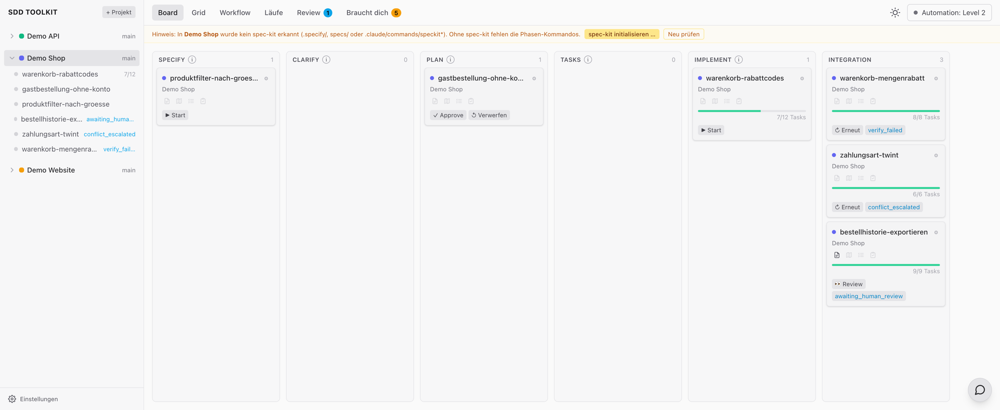
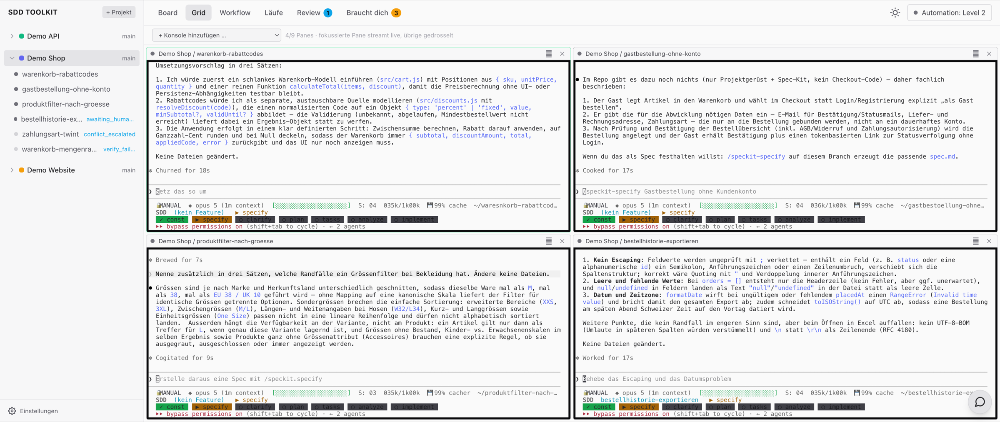
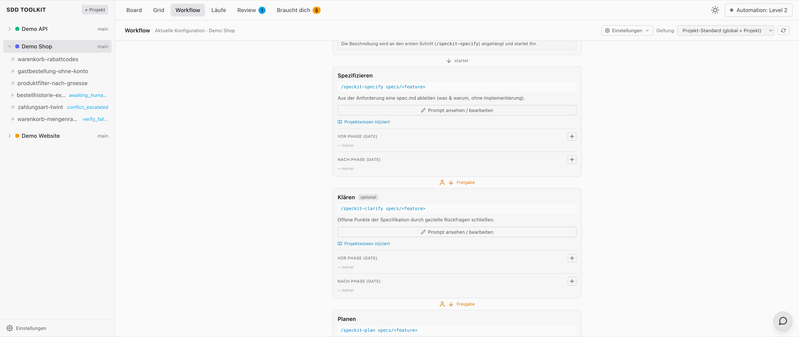
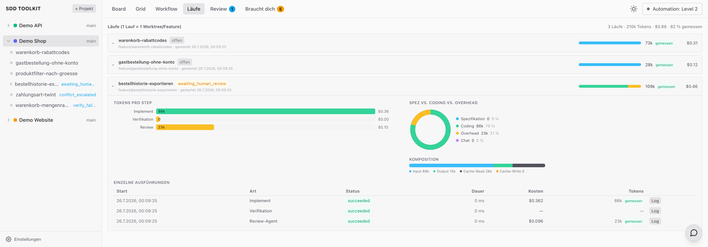
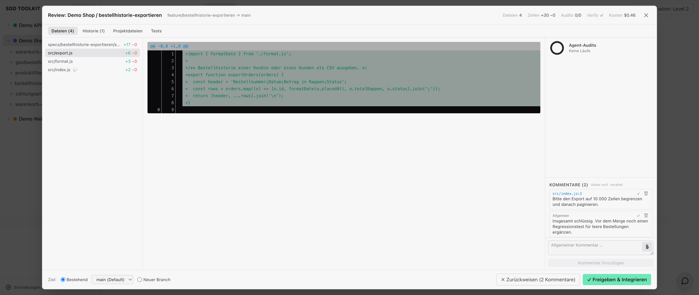
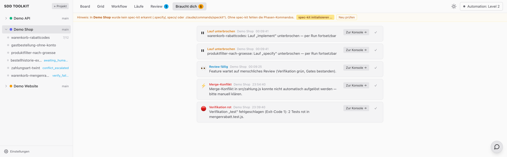
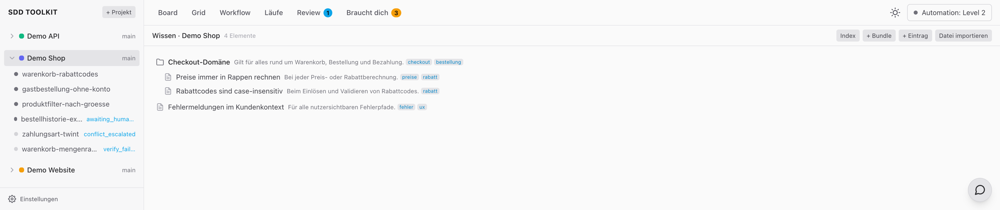

# SDD Toolkit — Spec-Driven Development über mehrere Repositories

Ein Worktree pro Feature. Eine Claude-Session pro Worktree. Eine Merge-Queue, die im
Zweifel eskaliert statt zu mergen.

> **English:** Local orchestrator that runs the
> [spec-kit](https://github.com/github/spec-kit) workflow as real Claude Code sessions,
> isolates every feature in its own git worktree, and merges through a queue with
> agent-based conflict resolution. Docs and code comments are in German.
>
> ⚠️ **Localhost only — no authentication.** See [SECURITY.md](SECURITY.md).



*Alle Bilder zeigen ein Demo-Projekt mit erfundenen Daten.*

## Inhalt

- [Funktionen](#funktionen) · [Voraussetzungen](#voraussetzungen) · [Installation](#installation) · [Quickstart](#quickstart)
- [Ablauf](#ablauf) · [Ansichten](#ansichten) · [Automation-Dial](#automation-dial)
- [Konfiguration](#konfiguration) · [Wofür geeignet](#wofür-geeignet) · [Architektur](#architektur) · [Sicherheit](#sicherheit)

## Funktionen

- **Worktree-Isolation** — Jedes Feature bekommt Branch und Worktree. Beliebig viele Agenten parallel, Haupt-Checkout unberührt.
- **Konsole pro Feature** — Dauerhafte Claude-Code-Session im Worktree. Läuft am Server weiter, wenn der Tab zugeht.
- **Merge-Queue mit Konfliktauflösung** — Rebase, Konflikte löst ein Headless-Agent mit der Spec beider Seiten, danach erneute Verifikation.
- **Exception-Inbox** — Nur Meldungen, deren Zustand noch besteht. Erledigtes verschwindet von selbst.
- **Agenten-Gates** — Frei belegbar vor und nach jeder Phase, blockierend oder beratend.
- **Projektwissen** — Selektiv pro Phase injiziert statt pauschal in den Kontext geladen.
- **Jira-Import** — Ticket zu Feature, mit vollem Ticketkontext im Worktree.
- **Token-Messung** — Autoritativ aus dem Claude-Transkript, nicht geschätzt.

## Voraussetzungen

| Anforderung | Version | Hinweis |
|---|---|---|
| Node | ≥ 22 | |
| git | ≥ 2.40 | Worktree-Unterstützung |
| Claude Code | aktuell | `claude` muss im PATH sein |
| pnpm | 10 | via `corepack enable` |
| spec-kit | aktuell | im **Ziel-Repo**, nicht hier |

## Installation

```bash
git clone https://github.com/whispers2011/sdd-toolkit.git
cd sdd-toolkit
pnpm install
```

Ziel-Repos brauchen spec-kit für die `/speckit-*`-Kommandos:

```bash
uvx --from git+https://github.com/github/spec-kit.git specify init --here --integration claude
```

Danach committen, damit Feature-Worktrees die Skills erben. Alternativ übernimmt das der
Banner im Tool.

## Quickstart

1. **Starten**
   ```bash
   pnpm dev                    # Server 4820, Web-UI 4830
   open http://localhost:4830
   ```

2. **Projekt hinzufügen** — Sidebar → „+ Projekt", Pfad zum Git-Repo. Vorhandene
   `specs/<feature>`-Ordner werden als Features importiert.

3. **Feature anlegen** — Name und Beschreibung. Es entstehen Branch, Worktree und eine
   Claude-Session; optional startet direkt `/speckit-specify`.

4. **Phasen durchlaufen** — Per Drag-and-drop im Board, über die Phasenleiste oder direkt
   in der Konsole.

5. **Integrieren** — Nach `implement` laufen Verifikation, Gates und Review. Freigabe
   schiebt das Feature in die Merge-Queue.

## Ablauf

```
Feature anlegen ─▶ specify ─▶ clarify ─▶ plan ─▶ tasks ─▶ implement ─▶ Verifikation ─▶ Review ─▶ Merge
       │                                                                    │            │         │
       ▼                                                                    ▼            ▼         ▼
  Branch, Worktree,                                                  Test/Build/Lint  Mensch   Rebase, Konflikt
  Claude-Session                                                      pro Projekt   entscheidet  per Agent, Cleanup
```

| Schritt | Was passiert |
|---|---|
| **Anlegen** | Branch `feature/<name>`, Worktree unter `~/.sdd-toolkit/worktrees/`, persistente Claude-Session. |
| **Phasen** | spec-kit-Kommandos in dieser Session. Vor jeder Phase wird passendes Projektwissen injiziert. |
| **Gates** | Agenten prüfen mit `VERDICT: PASS/FAIL` — etwa ein DoR-Gate vor `implement`. |
| **Verifikation** | Pro Projekt konfigurierte Kommandos (Test, Build, Lint). |
| **Review** | Diff, Kommentare, Audit-Ergebnisse, Ziel-Branch-Wahl. Reviewer-Änderungen erzwingen erneute Verifikation. |
| **Merge** | Rebase auf das Ziel. Konflikt → Headless-Agent mit Spec-Kontext → erneut verifizieren → mergen, Worktree entfernen. |
| **Ausnahme** | Scheitert irgendetwas, geht es in „Braucht dich". Kein Blind-Merge. |

## Ansichten

| Ansicht | Zweck |
|---|---|
| **Board** | Eine Bahn pro Schritt plus Integration. Drag-and-drop, Task-Fortschritt, Artefakt-Icons. |
| **Grid** | Bis zu 9 Konsolen nebeneinander, automatisch die aktiven. |
| **Workflow** | Die geltende Pipeline: Kommandos, Wissens-Injektion, Freigaben, Gates. |
| **Läufe** | Tokens und Kosten pro Schritt, nach Spezifikation/Coding/Overhead aufgeschlüsselt. |
| **Review** | Diff gegen den Ziel-Branch, zeilengenaue Kommentare, Agent-Audits. |
| **Braucht dich** | Rückfragen, rote Tests, gescheiterte Gates, eskalierte Konflikte, fällige Reviews. |

**Grid** — Eingabe direkt in die Konsole, fokussierte Pane streamt live, Rest gedrosselt.



**Workflow** — Jeder Schritt mit Kommando, Gates und Freigabepunkt, direkt bearbeitbar.



**Läufe** — Gemessen aus dem Transkript; Ungemessenes wird als solches ausgewiesen.



**Review** — Freigeben schiebt in die Queue, Zurückweisen gibt die Kommentare an die Session zurück.



**Braucht dich** — Meldungen verschwinden automatisch, sobald ihr Zustand nicht mehr besteht.



**Projektwissen** — Bundles mit Anwendbarkeit; vor jeder Phase wird nur das Relevante nach
`<worktree>/.sdd/knowledge/` materialisiert.



## Weitere Funktionen

| Funktion | Beschreibung |
|---|---|
| **Projekt-Chat** | Vollwertige Claude-Session in isolierter Arbeitskopie (`chat/<id>`). Schlägt Features vor, die per Klick real werden. |
| **Jira-Import** | Via Atlassian MCP mit OAuth, keine eigenen Token. Auswahl nach Site, Projekt, Sprint. Ticketkontext landet unter `specs/<slug>/jira/`. Schnappschuss, keine Synchronisation. |
| **Artefakt-Ansicht** | `spec.md`, `plan.md`, `tasks.md` und Checklisten lesbar gerendert und bearbeitbar. |
| **Brownfield-Import** | Vorhandene `specs/`-Ordner werden beim Hinzufügen als Features erkannt. |
| **PR-Modus** | Statt lokalem Merge einen GitHub-PR eröffnen, pro Projekt schaltbar. |
| **Komfort** | Projekt-Terminal, Change-Guard, ⌘K-Switcher, klickbare Dateipfade, Bild-Paste, Spracheingabe, Dark Mode. |

## Automation-Dial

Global einstellbar, pro Projekt und Feature überschreibbar.

| | Level 2 | Level 3 |
|---|---|---|
| Phasen | manuell gestartet | laufen durch |
| Verifikation | manuell | automatisch nach `implement` |
| Merge | manuell freigegeben | Queue arbeitet selbstständig |

Level 3 startet Agenten mit `bypassPermissions` — bewusste Entscheidung pro Projekt.

## Konfiguration

| Variable | Default | Zweck |
|---|---|---|
| `SDD_PORT` | `4820` | API und WebSockets |
| `SDD_WEB_PORT` | `4830` | Web-UI im Entwicklungsmodus |
| `SDD_HOST` | `127.0.0.1` | Bind-Adresse |
| `SDD_DATA_DIR` | `~/.sdd-toolkit` | Datenbank, Logs, Worktrees |
| `SDD_ALLOWED_ORIGINS` | — | zusätzliche Browser-Origins, kommagetrennt |

> ⚠️ `SDD_HOST` nicht setzen. Die API ist nicht authentifiziert und kann Shells starten,
> Kommandos ausführen und Dateien schreiben. Ein Reverse-Proxy hilft nicht; für
> Fernzugriff einen SSH-Tunnel nutzen.

## Wofür geeignet

**Passt:**
- Mehrere Repositories parallel, mehrere Features gleichzeitig
- Arbeit, die eine Spec verdient — mehrere Phasen, nachvollziehbare Entscheidungen
- Teams, die Agenten laufen lassen wollen, ohne blind zu mergen

**Passt nicht:**
- Einzeiler und triviale Fixes — der Overhead lohnt nicht
- Exploratives Prototyping ohne Ziel
- Alles, was nicht auf dem eigenen Rechner läuft (siehe Sicherheit)

## Architektur

```
packages/
├── shared/   Typen + pure State-Machines (Phasen, Session-Status)
├── server/   Fastify + WS, node-pty, better-sqlite3 (WAL), git-Engine
└── web/      React + Vite + Tailwind, xterm.js, Kanban, Inbox
```

| Entscheidung | Warum |
|---|---|
| **Hook-Bridge statt Output-Parsing** | Claude läuft mit `--settings`; Hooks schreiben Events in ein JSONL. Kein Raten anhand von Terminalausgabe. |
| **Pure State-Machines in `shared`** | Fachliche Entscheidungen ohne Mocks testbar. |
| **PTYs leben am Server** | Tab zu ≠ Session weg. Reconnect mit Scrollback-Replay, nach Neustart `claude --resume`. |
| **SQLite nur für Orchestrierung** | Die Spec-Wahrheit sind Dateien in `specs/`, versioniert mit dem Code. `~/.claude/` ist read-only. |

## Entwicklung

```bash
pnpm lint         # ESLint, keine Warnungen erlaubt
pnpm typecheck
pnpm test         # 471 Tests
pnpm build
```

Alles, was git anfasst, wird gegen echte Repositories in `mkdtemp` getestet. Migrationen
zusätzlich auf dem Aufstiegspfad: bestehende Datenbank mit Daten, von jedem Zwischenstand
auf aktuell, mit Nachweis des Datenerhalts.

Beispiel-Artefakte unter `specs/braucht-dich-meldungen-optimieren/` — das Werkzeug
entwickelt sich selbst damit. Agent-Prompts unter `docs/agents/`.

## Sicherheit

Lokales Werkzeug **ohne Authentifizierung**. Es kann Shells starten, Kommandos ausführen
und Dateien schreiben; im Auto-Modus mit `bypassPermissions`.

HTTP-API und WebSockets akzeptieren nur erlaubte Origins, der `Host`-Header muss lokal
sein (DNS-Rebinding). Das ersetzt keine Authentifizierung — es verhindert nur, dass eine
fremde Browser-Seite die lokale API fernsteuert.

Nur auf `127.0.0.1` betreiben. Bedrohungsmodell, Betriebsregeln und Meldeweg:
[SECURITY.md](SECURITY.md).

## Lizenz

[MIT](LICENSE) © 2026 whispers2011 · enthält Dateien aus
[github/spec-kit](https://github.com/github/spec-kit) (MIT), siehe
[THIRD-PARTY.md](THIRD-PARTY.md).
